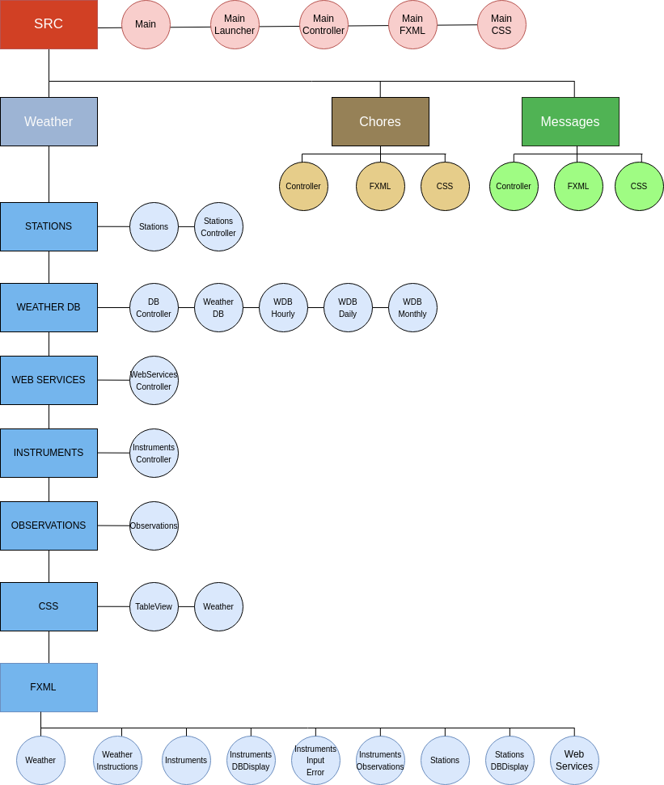

# Farm Hand

This application is developed by Adam Straub 2021 - current, and is intended as a demonstration of programming ability
in Java for consideration by recruiters and future employers.

If you have any questions about the project, have an employment opportunity, or know of any; I would love to hear from
you! Please use superduper.farmhand@manyme.com for correspondence. Cheers!

---

---

## table of contents

1. General Information
2. Technologies Used
3. Setup
4. Project Structure
5. Package, Class, and File Descriptions
6. Future Implementations

---

---

# I. General Information

This project is an application designed for use by a small team to assist in the management of a small scale farm or
hobby farm. It was developed with Agile Scrum principles in mind while imagining the application being developed by a
small team.

It is meant to be implemented from a standalone terminal in a central location frequented by team members. Functions to
include monitoring and recording weather, tracking progress of tasks, basic communication between team members.

Current functioning implementations include the main window for selecting subsections of the application and the weather
subsection. Please see further documentation for descriptions.

In this repository you will note 3 separate branches used during development.

- 'source_1' was primarily used while developing backend
- 'source_2' was used while developing GUI
- 'maven_build' was used while developing as maven based project

Ideas for additional features can be found in the code, section six of this README and the DEV-JOURNAL.md file in this
repository.

---

---

# II. Technologies Used

- java 17.0.1
- javaFX 17.0.1

    - base.jar
    - controls.jar
    - fxml.jar
    - graphics.jar
    - media.jar
    - web.jar

- sqlite-jdbc 3.32.3.2.jar
- json-simple 1.1.1.jar
- CSS
- sqlite-3 3.31.1
- intellij
- SceneBuilder
- DBBrowser for SQLite

---

---

# III. Setup

You may consult the 'maven' branch found in this repository to assist with dependencies or you will need the libraries
listed above for your platform. Please note that javafx is not maintained by oracle and the libraries are operating
system specific.

You may consult the 'maven' branch found in this repository to assist with dependencies or you will need the libraries listed above for your platform. The maven build will most likely overtake the master build in the future. 

Please note that javafx is not maintained by oracle and the libraries are operating system specific.

If you are unfamiliar with setting up a javafx project please consider the following resources.

Eclipse:
https://www.youtube.com/watch?v=_7OM-cMYWbQ

IntelliJ:
https://www.youtube.com/watch?v=Ope4icw6bVk

### Please note that you will need your own API key from https://openweathermap.org/api which is implemented in the 'stations' class

---

---

# IV. Project Structure

Our current project structure kind of looks like the following:

---

---

# V. Package, Class and File Descriptions

Please note further documentation and notes may possibly be found in the code.

---

## Package SRC:

Contains the following:

| Package/Class                | Description                                                                                                                                                                                                                                                                                     |
| ---------------------------- | ----------------------------------------------------------------------------------------------------------------------------------------------------------------------------------------------------------------------------------------------------------------------------------------------- |
| Class: &nbsp; Main           | Launches our main args comprised of calling the createWeatherDB() method from the WeatherDB class in the Weather package and weatherdb sub package. It builds our sqlite db in the src package if it doesn't already exist. Also creates our primary stage and loads the appropriate fxml file. |
| Class: &nbsp; MainLauncher   | A helper class that calls the main method without extending javafx application. Critical in packaging at this time apparently.                                                                                                                                                                  |
| Class: &nbsp; MainController | Contains methods for action handlers pertaining to the appropriate controls of the main stage as well as the logic in opening and closing the secondary stages.                                                                                                                                 |
| File: &nbsp; main.fxml       | Describes the elements found on the main stage and links to the controller so that in changes made their are reflected in the graphic display of the stage.                                                                                                                                     |
| File: &nbsp; MainCSS.css     | Further describes individual elements or groups of elements for for increased appearance customization.                                                                                                                                                                                         |
| Package: &nbsp; Weather      | Contains all packages, classes and files pertaining to the 'Weather' sub-section of this application.                                                                                                                                                                                           |
| Package: &nbsp; Chores       | Contains all packages, classes and files pertaining to the 'Chores' sub-section of this application. Currently in development. Files here are essentially placeholders.                                                                                                                         |
| Package: &nbsp; Messages     | Contains all packages, classes and files pertaining to the 'Messages' sub-section of this application. Files here are essentially placeholders.                                                                                                                                                 |

---

## Package Weather:

Contains the following:

| Package/Class                   | Description                                                                                                                                                                                                                                                                                              |
| ------------------------------- | -------------------------------------------------------------------------------------------------------------------------------------------------------------------------------------------------------------------------------------------------------------------------------------------------------- |
| Class: &nbsp; WeatherController | Contains methods corresponding to controls of the Weather secondary stage, sub-sections, and includes a method for populating the stage with a new scene by simply entering the name of the appropriate fxml file. Also determines the display size and set a flag for whether stage is maxed.           |
| Package: &nbsp; webservices     | Contains all classes pertaining to the webservices sub-section. This sub-section allows user to view weather websites directly in the application.                                                                                                                                                       |
| Package: &nbsp; weatherdb       | Contains all classes pertaining to the creation, management and display of the weather db.                                                                                                                                                                                                               |
| Package: &nbsp; stations        | Contains all classes pertaining to the stations sub-section. This sub-section allows user to view weather conditions from a weather station based on the coordinates they enter. They then have the option to log the conditions, view the db logs and get observations based on what has been recorded, |
| Package: &nbsp; observations    | Contains all classes pertaining to making observations on the state of the weather based on entries stored to the weather db.                                                                                                                                                                            |
| Package: &nbsp; instruments     | Contains all classes pertaining to the instruments sub-section. This subsection allows the user to manually enter weather conditions and view the database.                                                                                                                                              |
| Package: &nbsp; FXML            | Contains all FXML files used in the creation of the weather sub-sections.                                                                                                                                                                                                                                |
| Package: &nbsp; CSS             | Contains all CSS files pertaining to the weather sub-section of the main application.                                                                                                                                                                                                                    |

---

## Package webservices:

Contains the following:

| Package/Class                       | Description                                                                                                                                                                                                                                            |
| ----------------------------------- | ------------------------------------------------------------------------------------------------------------------------------------------------------------------------------------------------------------------------------------------------------ |
| Class: &nbsp; WebServicesController | Contains methods corresponding to controls of the web services subsection as well as creating a web viewier which displays various weather websites from directly in the application. Clicking the links/buttons on the left will bring up a new site. |

---

## Package weatherdb:

Contains the following:

| Package/Class                 | Description                                                                                                                                                                                                                                                                                                                         |
| ----------------------------- | ----------------------------------------------------------------------------------------------------------------------------------------------------------------------------------------------------------------------------------------------------------------------------------------------------------------------------------- |
| Class: &nbsp; WeatherDB       | Contains methods for the creation of the weather database. Also contains methods utilized by other classes pertaining to the database and its tables including the logic for which table to write to when, resetting the tables and comparing some of their information. This helps in establishing a self managing db.             |
| Class: &nbsp; WeatherDBHourly | Contains a constructor used to display the contents of the table in the GUI. As well it contains methods for establishing time and converting it into a human readable format. As well as writing data to the hourly table.                                                                                                         |
| Class: &nbsp; WeatherDBDaily  | Contains methods pertaining to gathering information from the hourly table and using it to write entries to the daily table. There is a method to convert timestamps in to a human readable format that records the date of the entry to the daily table. There is also a method for determining between the same day or a new day. |
| Class: &nbsp; WeatherDBWeekly | Gathers information from the daily table and makes a weekly entry.                                                                                                                                                                                                                                                                  |
| Class: &nbsp; DBController    | Models our weather database for use by our fxml file in order to display the contents of the database to the user.                                                                                                                                                                                                                  |

---

## Package stations:

Contains the following:

| Package/Class                    | Description                                                                                                                                                                                                                                                                                                                            |
| -------------------------------- | -------------------------------------------------------------------------------------------------------------------------------------------------------------------------------------------------------------------------------------------------------------------------------------------------------------------------------------- |
| Class: &nbsp; Stations           | Gets the input from the user for a set of coordinates and plugs them into our api call. We open a scanner for the JSON response from the and then parse the desired information and format it in to the desired result which is then displayed to the user. Also contains methods for writing that information to the hourly database. |
| Class: &nbsp; StationsController | Methods for all subsection controls as well as validating user input. Log button will record displayed station readout to the database. View Logs will display the database tables. Observations will display observations made based on db entries.                                                                                   |

---

## Package observations:

Contains the following:

| Package/Class              | Description                                                                           |
| -------------------------- | ------------------------------------------------------------------------------------- |
| Class: &nbsp; Observations | Contains methods for logic and readouts of conditions observed from database entries. |

---

## Package instruments:

Contains the following:

| Package/Class                       | Description                                                                                                 |
| ----------------------------------- | ----------------------------------------------------------------------------------------------------------- |
| Class: &nbsp; InstrumentsController | Methods for controls of the instruments sub-section and displaying the database. Also validates user input. |

---

## Package FXML:

Contains the following:

| Package/Class                             | Description                                                                                                            |
| ----------------------------------------- | ---------------------------------------------------------------------------------------------------------------------- |
| File: &nbsp; weather.fxml                 | Describes elements used across the Weather section. Is implemented across almost all other fxml files in this section. |
| File: &nbsp; weatherInstructions.fxml     | Describes elements for a splash page for the user with general instructions. Includes weather.fxml.                    |
| File: &nbsp; webservices.fxml             | Describes elements used across the webservices sub-section. Includes weather.fxml.                                     |
| File: &nbsp; stations.fxml                | Describes elements used across the stations sub-section. Includes weather.fxml.                                        |
| File: &nbsp; stationsDBDisplay.fxml       | Describes elements used to display the weather db in the stations sub-section. Includes weather.fxml.                  |
| File: &nbsp; instruments.fxml             | Describes elements used to display the instruments sub-section. Includes weather.fxml.                                 |
| File: &nbsp; instrumentsDBDisplay.fxml    | Describes elements used to display the weather db in the instruments sub-section. Includes weather.fxml.               |
| File: &nbsp; instrumentsInputError.fxml   | Describes elements used to display input errors in instruments sub-section. Includes instruments.fxml.                 |
| File: &nbsp; instrumentsObservations.fxml | Describes elements used to display weather observations in instruments sub-section. Includes instruments.fxml.         |

---

## Package CSS:

Contains the following:

| Package/Class                  | Description                                                                                            |
| ------------------------------ | ------------------------------------------------------------------------------------------------------ |
| File: &nbsp; WeatherCSS.css.   | Further describes elements used across the weather section of this application for more customization. |
| File: &nbsp; TableViewCSS.css. | Further describes elements used in the display of the weather database.                                |

---

## Package Chores:

Contains the following:

| Package/Class                  | Description                                                     |
| ------------------------------ | --------------------------------------------------------------- |
| Class: &nbsp; ChoresController | Methods for controls of the 'chores' secondary stage.           |
| File: &nbsp; ChoresCSS.css.    | Further describes elements used in 'chores' section.            |
| File: &nbsp; chores.fxml.      | Describes elements used in the display of the 'chores' section. |

---

## Package Messages:

Contains the following:

| Package/Class                    | Description                                                       |
| -------------------------------- | ----------------------------------------------------------------- |
| Class: &nbsp; MessagesController | Methods for controls of the 'messages' secondary stage.           |
| File: &nbsp; MessagesCSS.css.    | Further describes elements used in 'messages' section.            |
| File: &nbsp; messages.fxml.      | Describes elements used in the display of the 'messages' section. |

---

---

# VI. Future Implementations

At this point what I would like to include in the future is:

- Refine what has been developed so far.
- Get in functioning versions of the 'Messages' and 'Chores' sections.
- Further down the road I feel as though some sort of inventory system would also be beneficial.

---

## Thank you for checking out this project and please feel free to contact me with any questions, cheers!

-Adam
